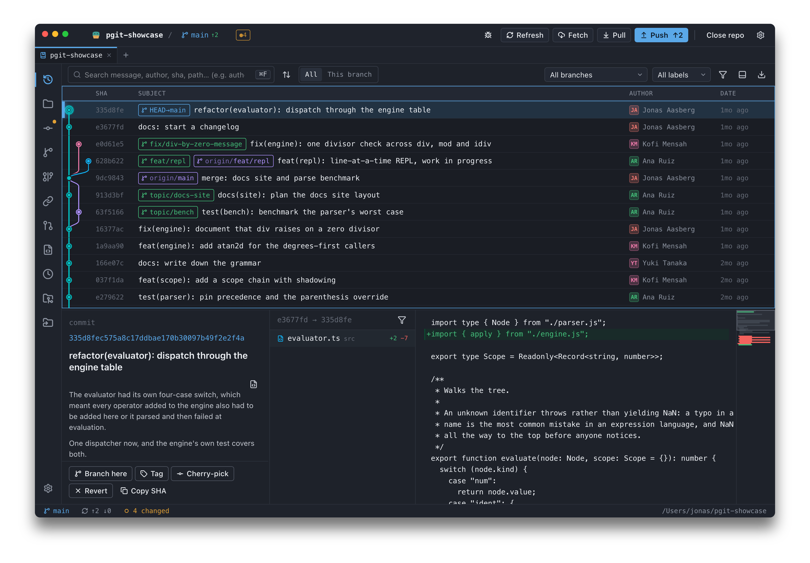

<div align="center">


# platypusgit

**A fast, keyboard-driven git desktop app for developers.**<br>
Free and open source. No account, no telemetry. macOS, Windows, Linux.

[](https://github.com/jonassaa/platypusgit/releases/latest)
[](./LICENSE)
[](#install)
[](https://github.com/jonassaa/platypusgit/actions/workflows/tests.yml)

[**Download**](https://www.platypusgit.com/download/) ·
[Website](https://www.platypusgit.com) ·
[Features](https://www.platypusgit.com/features/) ·
[Changelog](https://www.platypusgit.com/changelog/)

</div>



## Install

**macOS** — Homebrew is the smoothest route; it installs the [`pgit`](#the-pgit-command) command with the app and owns updates.

```bash
brew install --cask jonassaa/platypusgit/platypusgit   # install
brew update && brew upgrade --cask platypusgit         # update
```

The app is ad-hoc signed but not notarized. The cask clears the macOS Gatekeeper
quarantine flag on install, so it launches with no "unidentified developer"
prompt. No Homebrew? Take the `.dmg` below — a drag-install needs the quarantine
flag cleared by hand.

**Windows** — [`PlatypusGit_x64.msi`](https://github.com/jonassaa/platypusgit/releases/latest/download/PlatypusGit_x64.msi). Installs `pgit` and puts it on your PATH. Not code-signed, so SmartScreen will warn on first run.

**Linux** — needs `webkit2gtk 4.1`. The package ships `/usr/bin/pgit`; the AppImage installs nothing.

```bash
sudo apt install ./PlatypusGit_amd64.deb
```

[`.deb`](https://github.com/jonassaa/platypusgit/releases/latest/download/PlatypusGit_amd64.deb) ·
[`.AppImage`](https://github.com/jonassaa/platypusgit/releases/latest/download/PlatypusGit_amd64.AppImage) ·
[`.dmg`](https://github.com/jonassaa/platypusgit/releases/latest/download/PlatypusGit_universal.dmg) ·
[`.msi`](https://github.com/jonassaa/platypusgit/releases/latest/download/PlatypusGit_x64.msi) ·
[all releases](https://github.com/jonassaa/platypusgit/releases)

Every route, per platform, with the Gatekeeper and update notes spelled out:
[platypusgit.com/download](https://www.platypusgit.com/download/).

## Why another git GUI

- **Free, all of it.** GPL-3.0, no license fee, no per-seat pricing, no "pro" tier gating rebase or conflict resolution.
- **No account, no telemetry.** Nothing to sign in to and no analytics SDK anywhere in the tree. Your repositories and history never leave your machine. Forge tokens for the optional pull-request integration are yours, supplied by you and stored by your own git credential helper.
- **Native, not a bundled browser.** A small Tauri binary with real OS windows on all three platforms.
- **Keyboard-first and dense.** A Rider-style default keymap, a command palette, type-to-jump lists, hunk navigation and staging without touching the mouse — a dev-first TortoiseGit alternative that assumes you know git.

## Features

- **Start anywhere** — open a repository, clone one (submodules included, with progress), or init a new one, and keep the ones you use in the recent list.
- **Staging that goes down to the line** — stage, unstage or discard whole files, individual hunks, or single lines; drag files between Changes and Staged; commit with amend and author override.
- **Diffs built for reading** — whole-file diffs with no `@@` banners and a scrubable minimap, unified or side-by-side, syntax highlighting and word-level intra-line marks, configurable context, commit-to-commit and range diffs, branch compare, blame, and a file browser at any revision.
- **Branches, tags and history** — full ref management, merge or rebase from the branch picker, lightweight/annotated/signed tags, a commit graph with ref-scoped log, search by message, author, SHA, date or path, per-file history and a reflog viewer.
- **Rewriting, safely** — interactive rebase (pick/reword/edit/squash/fixup/drop, drag to reorder, resumable after quitting the app), reset, cherry-pick, revert, and bisect with git's own progress estimate.
- **Conflicts in one place** — 3-way sides, a dedicated ours · result · theirs resolver window, accept ours/theirs, external mergetool, and an operation bar that says what is in progress.
- **Stash, including partial** — save/apply/pop/drop, stash only the paths you selected, rename, compare, stash to a new branch.
- **Remotes with working auth** — add/remove/rename/prune, fetch/fetch-all/pull, push with-lease or force; every network op prompts for credentials and retries, tag pushes and branch deletes included.
- **Pull requests without the browser** — GitHub and GitLab, self-hosted included: list open requests, read the CI summary, check one out (forks too), or open one from the current branch.
- **The repositories inside your repository** — submodule and linked-worktree screens, and a git-LFS panel with pointer-aware diffs.
- **Several repos, one window** — multi-repo tabs, each with its own screen and badges, plus resizable panes and a `?` cheat sheet.

The exhaustive list — every keybinding and option — lives at
[platypusgit.com/features](https://www.platypusgit.com/features/).

## The `pgit` command

`pgit` opens the app on a repository from the terminal and hands the prompt
straight back.

```bash
pgit                    # plain launch — last persisted repo/screen
pgit .                  # open the repo containing cwd
pgit ~/dev/foo          # open the repo containing that path
pgit commit             # open the cwd repo, land on the Commit panel
pgit log src/           # open the repo containing src/, land on History
pgit --help             # print usage, no window
```

| subcommand | screen |
|---|---|
| `commit`, `status` | Commit panel |
| `log`, `history` | History |
| `branches`, `branch` | Branches |
| `files`, `browse`, `tree` | Files |
| `rebase` | Rebase |
| `remote`, `remotes` | Remotes |
| `pr`, `prs`, `pulls` | Pull requests |
| `reflog` | Reflog |
| `submodules` | Submodules |
| `worktrees` | Worktrees |
| `settings`, `config` | Settings |

A bare path with no recognized subcommand opens that repository and keeps the
current screen. If the app is already running, a second `pgit …` doesn't spawn
another instance — it forwards the request to the running window, focuses it,
and navigates there.

**Most installs already have it.** The Homebrew cask, the `.deb` and the `.msi`
install `pgit` alongside the app and remove it on uninstall. Only the macOS
`.dmg` and the Linux AppImage run no install code, so those two need
**Settings → Command line → Install** in the app, or:

```bash
curl -fsSL https://www.platypusgit.com/install-pgit.sh | sh    # macOS .dmg / Linux AppImage
irm https://www.platypusgit.com/install-pgit.ps1 | iex         # Windows, outside the .msi
```

Both scripts are meant to be read before they are run — they are a build-time
copy of [`scripts/install-pgit.sh`](./scripts/install-pgit.sh) and
[`.ps1`](./scripts/install-pgit.ps1), and both take `--dry-run`.

## Status

**Active development, versioned 0.0.x** — expect frequent releases and rough
edges. Most core git operations work end to end (the feature list above is what
is implemented, not a roadmap). Known gaps, stated plainly:

- macOS builds are ad-hoc signed and not notarized; the Windows `.msi` is not code-signed.
- No `winget`/`scoop`/apt repository yet, so on Windows and Linux install and update are a manual download ([#187](https://github.com/jonassaa/platypusgit/issues/187)).
- Standalone GUI only. Shell integration — Finder/Explorer icon overlays and context menus — is out of scope.

Found a bug or want a feature? [Open an issue](https://github.com/jonassaa/platypusgit/issues).

## Development

```bash
pnpm install
pnpm tauri dev     # first run compiles the whole Rust tree: 2-5 min. Reruns ~10s.
```

Needs Node 22+, pnpm and Rust stable, plus the platform build tools listed in
[`CONTRIBUTING.md`](./CONTRIBUTING.md#prerequisites).

```bash
pnpm tauri build --no-sign     # .dmg / .msi / .deb / .AppImage in src-tauri/target/release/bundle/
```

`--no-sign` is not optional locally: the Tauri config carries an updater public
key, and a build that produces updater artifacts without the matching private
key (`TAURI_SIGNING_PRIVATE_KEY`) fails hard.

[`CONTRIBUTING.md`](./CONTRIBUTING.md) owns the full setup, the test commands and
the PR workflow. The architecture tour for humans is in
[`docs/dev/`](./docs/dev/) — [`architecture.md`](./docs/dev/architecture.md)
(annotated source trees), plus `frontend.md`, `backend.md`, `testing.md` and
`distribution.md`. Design specs and implementation plans live under
[`docs/superpowers/`](./docs/superpowers/).

## Contributing

Contributions welcome — including documentation and triage. Start with
[`CONTRIBUTING.md`](./CONTRIBUTING.md), pick up a
[good first issue](https://github.com/jonassaa/platypusgit/labels/good%20first%20issue),
and please read the [Code of Conduct](./CODE_OF_CONDUCT.md).

## License

[GNU General Public License v3.0](./LICENSE).
