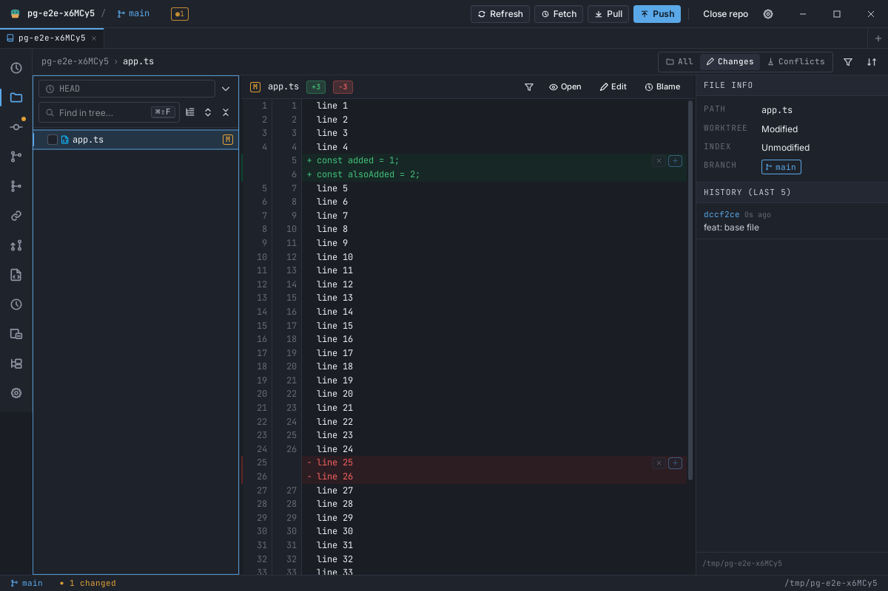
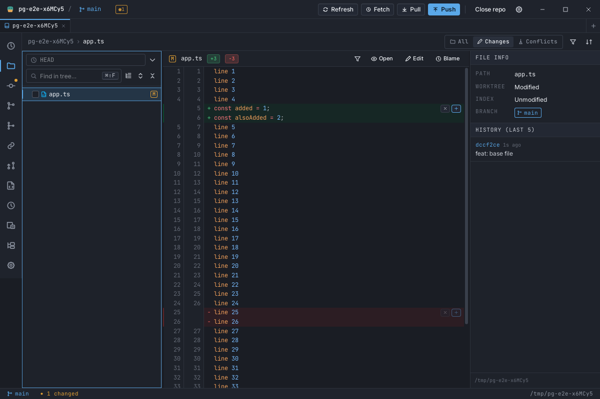
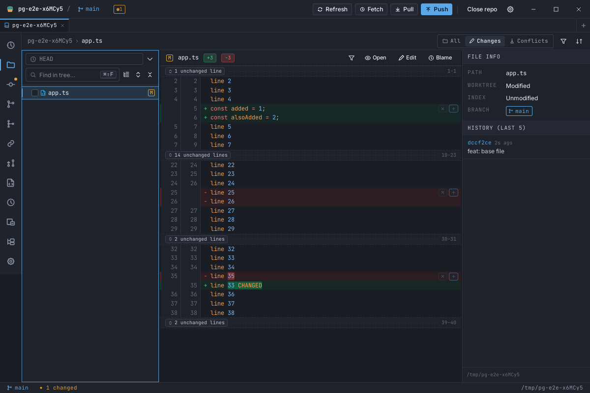
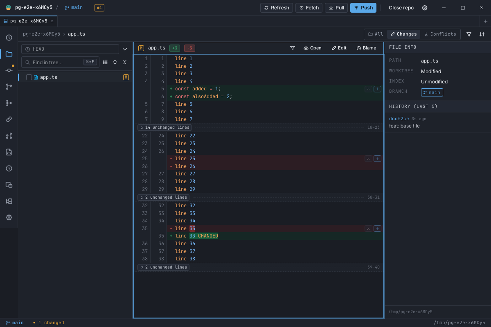

# Continuous diff view — no `@@` hunk banners (#157)

Status: approved for implementation.
Issue: [#157](https://github.com/jonassaa/platypusgit/issues/157).

## Goal

The file diff reads like Rider's Differences Viewer: one continuous file where
changed lines carry a coloured background, and nothing cuts the file into
labelled `@@` sections.

Deliberate divergence from Rider, taken from the issue: **green additions, red
removals**, not Rider's green/blue/grey. `--git-added` / `--git-deleted` and a
red/green vocabulary are already everywhere in this app; adopting blue-for-modified
here would fight the rest of it for no gain.

The colouring itself is already built — `PGDiffRow` gives an `add`/`rem` row
`--git-added-bg` / `--git-removed-bg` plus a 2px gutter stripe. So this change is
almost entirely about **removing `PGHunkHeader` and rehoming the four things it
anchors**, plus giving the one surface that never had the tint (`CommitDiffPanel`)
the same treatment.

## What exists today

`flattenDiffRows` (`src/lib/diffRows.ts`) emits `{ kind: "header", hunkIndex,
header, h: headerH }` before each hunk's line rows. Two renderers consume it:

- `PGWindowedDiff` — the Diff screen, the commit panel, the repo browser. It
  strips the markers (`row.header.replace(/^@@\s*|\s*@@$/g, "")`) and hands the
  rest to `PGHunkHeader`, which puts them straight back (`@@ {header} @@`). That
  round trip is deleted here regardless of every other decision.
- `CommitDiffPanel` — its own lighter markup (no line-number gutters, tighter
  rows for the History inline panel). It renders `row.header` raw, so the raw
  `@@ -12,7 +12,9 @@` string is what the reader sees there.

`PGHunkHeader` is a full-width `--bg-2` bar carrying: a collapse chevron, the
range in accent colour, a Discard button and a Stage-hunk button. It is also the
host of `data-hunk-index` / `data-hunk-active`, which is how F7 navigation and two
e2e specs address hunks.

## Why the banner is worst in the default view

`diffContextMode` defaults to `"wholeFile"`, and whole-file mode composes the
whole file on the frontend: the canonical diff is left exactly as fetched and the
unchanged remainder is filled in around it as `fill` rows. So in the default view
**there is no gap for a hunk header to label** — every line between two hunks is
already on screen. The banner announces a boundary the reader cannot see.

In chunked mode the gaps are real, and they need an affordance — but a `@@`
range label is the wrong one. The right one is a fold separator that says how much
is hidden and offers to show it.

## The four decisions

### 1. Stage / Discard per hunk → a gutter cluster on the hunk's first changed row, plus two chords

`hunkActions` keeps its shape and its three call sites. What changes is where it
renders: **`PGHunkActions`, absolutely positioned at the right edge of the hunk's
first changed row**, inside a `position: relative` wrapper that also carries
`data-hunk-index`.

Two small buttons: stage/unstage (`plus` / `check`) and discard (`x`). The stage
button keeps `data-testid="hunk-stage"` — it is still the Stage-hunk affordance,
so `history-diff.e2e.ts` and four component tests address the same thing they
always did. When lines are selected it grows a text label (`3 lines`), which is
what `CommitPanel.lineStaging` and `CommitPanel.lineFocus` assert on; with no
selection it is icon-only and its `textContent` is empty, which is what
`lineStaging` asserts for that case.

**Idle at `opacity: .45`, full on hover of its row.** The issue recommends
hover-only reveal, which is Rider's answer because Rider's gutter is always
present to hover. Ours is not: a windowed diff cannot wrap a hunk in a container
(a hunk's rows are routinely split across the window boundary — that is why
`PGDiffRow` paints its background per row), so "hover anywhere in the hunk" would
need React state driven by pointer motion over a 60-row slice. Hovering the one
19px anchor row is the only cheap hover target, and an affordance you can only
discover by hovering the exact row it lives on is not discoverable at all. Dim
always + bright on hover keeps it quiet, keeps it findable, and keeps it
`waitForDisplayed`-able in e2e (a WebDriver-displayed check fails at `opacity: 0`).

The wrapper is `pointer-events: none` with `auto` on the buttons, so the row's own
click (line selection) is unaffected everywhere except exactly on a button.

**Keyboard.** The old header's buttons were *not* keyboard-reachable: `Tab` is
bound to `pane.focusNext` globally, so DOM focus never enters a pane's buttons.
This change fixes that rather than preserving it, with two new pane-scoped catalog
actions:

| action | chord (both presets) | acts on |
| --- | --- | --- |
| `diff.stageHunk` | `Mod+Shift+H` | the F7 hunk cursor, else the line cursor's hunk |
| `diff.discardHunk` | `Mod+Shift+Backspace` | same |

Chord choices: `Mod+Shift+<letter>` is where repo ops already live
(`S`/`U`/`M`/`K`/`T`/`Y`/`F`/`N`/`O`), `H` is free in both presets and is not a
`Mod+Alt+<letter>` (the AltGr hazard `presets.test.ts` polices). `Backspace` is a
named key, free, and reads as destructive; the discard path `pgConfirm`s exactly as
the button does. Neither is `Alt`+printable, so neither needs `suppressInInput`,
and both are pane-scoped so they only fire while a diff pane holds focus.

Making the chords work required giving the commit panel's and the repo browser's
diff panes a hunk cursor at all — **`useHunkNav` is now wired in all four
surfaces**, not just the Diff screen and the commit-diff panel. F7 in the commit
panel previously did nothing.

### 2. Per-hunk collapse does not survive

`collapsed: ReadonlySet<number>` and `onToggleHunk` are removed from
`flattenDiffRows`, from `PGWindowedDiff` and from the three screens that held the
state.

1. In whole-file mode — the default — collapsing a hunk hid the change while its
   surrounding context stayed, i.e. the file with a hole in it, and the only thing
   naming the hole was the banner that is now gone.
2. The chevron had no host left. A collapse chevron on a code row would sit two
   pixels from the fold separator's *expand* chevron and mean the opposite thing.
3. The F7 anchor and the hunk actions now live on the hunk's first changed row. A
   collapsed hunk has no rows, so it would be unreachable by F7 and would lose its
   Stage/Discard — unless collapse grew a placeholder row, which is the banner
   again under a new name.
4. What collapse was actually good for — hiding unchanged stretches — is what
   chunked mode's fold separator does explicitly, and what whole-file mode does by
   default.

### 3. The F7 anchor moves to each hunk's first changed row

`data-hunk-index` and `data-hunk-active` move from the header wrapper to a
wrapper around the hunk's **first changed (`+`/`-`) row**, marked by
`flattenDiffRows` as `hunkAnchor: true`. A hunk with no changed row at all is not
something git emits but a caller can construct one, so the anchor falls back to
the hunk's first row: **every hunk index has exactly one anchor row,
unconditionally**, which is what F7 and the hunk actions both need.

This is a better target than the header was. F7 is Rider's *NextDiff* — "go to the
next change" — and the first changed line is the change; the banner was one to
three context lines above it.

`useHunkNav` gains an optional `scrollToHunk(hunkIndex)`, and all four surfaces
supply an offset-based one built on `hunkAnchorRows(rows)` + `scrollTopForRow`. The
hook's own `querySelector` + `scrollIntoView` stays only as the fallback for
unwindowed callers and its unit test: under windowing the anchor row is usually
unmounted, so the DOM route silently does nothing (the #68 G10 trap). It mattered
less when the anchor was a header; it matters more now, because a line row is
smaller and unmounted more often.

`changedIndex` is untouched by all of this. It is still assigned once by
`withChangedIndices`, over the whole hunk, before anything slices rows, and every
consumer still reads it **off the row** — `hunkAnchor` is a separate, additive
boolean and no code derives one index from the other.

### 4. `DiffRow`'s `header` variant is replaced by `fold`

```ts
export type DiffRow =
  | { kind: "line"; hunkIndex: number; line: DiffLineData; h: number; hunkAnchor?: true }
  | { kind: "fill"; line: DiffLineData; h: number }
  | { kind: "fold"; gapIndex: number; hiddenLines: number; fromL: number; fromR: number; h: number };
```

Nothing renders a header any more, so nothing emits one — the windowing
arithmetic must not reserve height for an invisible row.

`fold` has **no `hunkIndex`**, for the same reason `fill` has none: consumers look
up `hunkActions(row.hunkIndex)` and wire `onLineClick(row.hunkIndex, …)`, so a
sentinel would be one missing guard away from staging the wrong hunk. The type
checker makes every consumer say what it does with each variant.

## Chunked mode: what replaces the banner

A **fold separator** (`PGFoldSeparator`) per gap: a slim row with a dashed rule, a
chip reading `42 unchanged lines`, an expand control, and the skipped range
(`5–46`, new-side numbering) at the right. So the discontinuity is labelled with
what it actually is — an amount of unchanged file — rather than with two `@@`
line-range pairs the reader has to subtract.

Gap counts come from the hunk headers alone (`oldStart`/`oldLines`/`newStart` /
`newLines`, through the same `effStart` normalization of git's `+N,0` convention),
so they need no file text and cannot be wrong when the text is missing.

- A **leading** gap (the file starts above hunk 0) and every **inter-hunk** gap get
  a separator.
- The **trailing** remainder gets one only when the file text is available, because
  without it there is no way to know how many lines follow the last hunk. A
  separator that cannot say how much it hides is worse than the file simply
  ending, and inventing a count is not an option.

**The expand control fills that gap in place.** `PGWindowedDiff` takes
`onExpandGap(gapIndex)`; the screen holds an `expandedGaps` set (replacing the
`collapsed` set it used to hold — net zero state) and passes it back to
`flattenDiffRows`, which emits `fill` rows for those gaps through the *same*
`gapRows` whole-file mode uses. The control is rendered only when the caller
supplies `onExpandGap` and the text is there to expand from; otherwise the
separator is informational and says so in its title.

## The `gaps` option, and the degradation ladder

`flattenDiffRows`' `wholeFile?: { newText, oldText }` becomes two orthogonal
options, because "which text" and "what to do with a gap" are different questions
and chunked mode now needs the text too:

```ts
flattenDiffRows(hunks, {
  rowH, foldH,
  syntax?,
  text?: { newText: string | null; oldText: string | null },
  gaps?: "fill" | "fold",              // default "fold"
  expandedGaps?: ReadonlySet<number>,  // gaps: "fold" only
})
```

`useWholeFile` becomes `useDiffGaps`, returning `{ gaps, text }` — one hook, still
the only place the surfaces read `diffContextMode`, so they cannot drift.

Degradation is now two-tier, and the tier depends on *what* went wrong:

| failure | result | why |
| --- | --- | --- |
| a gap's two sides disagree on length, or a descending range | `"fold"` output with **no** separators | the diff is not the shape assumed here, so no gap count is trustworthy either |
| no text, text past `MAX_WHOLE_FILE_LINES`, text too short to fill | `"fold"` output **with** separators | the structure is sound; only the filling is impossible |

The second tier is what makes whole-file mode's "text arrives late" path
(`useDiffSyntax` reads the sides asynchronously) render separators rather than a
silently joined file, and it is why the existing "degrades to chunked" tests still
hold as written: chunked output *is* fold output.

## Surfaces

| surface | renderer | changes |
| --- | --- | --- |
| Diff screen (`DiffViewer`) | `PGWindowedDiff` | folds, anchor, `expandedGaps`, offset scroll for F7; no hunk actions (it never had any) |
| Commit panel (`CommitPanel`) | `PGWindowedDiff` | folds, anchor, action cluster, `expandedGaps`, new hunk cursor + the two chords |
| Repo browser (`RepoBrowser`) | `PGWindowedDiff` | same as the commit panel |
| Commit diff (`CommitDiffPanel`) | its own lighter markup | header row → fold separator, anchor attrs, offset scroll, **and the add/rem background tint + gutter stripe it never had** |

`CommitDiffPanel` is deliberately not folded into `PGWindowedDiff` here. Its
markup is tuned for the narrow History inline panel (no line-number gutters,
tighter rows) and it is read-only, so it needs none of the staging machinery;
unifying the two renderers is a worthwhile follow-up but it is not this issue.
Both continue to share `flattenDiffRows`, so there is still exactly one row model.

## Invariants this change must not break

- **`changedIndex` is read off the row, never derived.** `stage_lines` /
  `unstage_lines` / `discard_lines` accept nothing else.
- **`fill` and `fold` carry no `hunkIndex`**, so neither can reach a staging path.
- **Whole-file filler stays purely additive**: with folds off, the hunk rows are
  byte-identical to chunked mode's, or a hunk index has shifted and staging would
  apply the wrong lines.
- **Line ops inherit the ignore-whitespace gate.** Both the click path and the
  keyboard cursor stay off when `useHunkActionsDisabledReason` is set, and the two
  new chords are disabled by the same reason string the buttons are.
- **Scroll by offset**, never `querySelector` + `scrollIntoView`.
- **`isTextualDiff(diff)`** remains the text gate.
- Row geometry stays on `--lh-code` (`--diff-row-h`); the fold separator is chrome
  and takes `--row-step`, exactly as the header did.

## Out of scope

- Rider's highlighting-granularity setting (words / lines / characters / none).
  Word spans are always on here.
- Collapsing unchanged fragments in *whole-file* mode. Whole-file mode's contract
  is "the whole file"; the setting to get folds is `diffContextMode: "chunked"`.
- Unifying `CommitDiffPanel` onto `PGWindowedDiff` (above).
- The dead `DiffLineKind: "hunk"` variant in `PGDiffLine`, which renders a literal
  `@@` and has no producer anywhere. Removing it touches `PGSideBySideDiff`'s
  types; it is noted, not done.

## How it renders

Captured from the e2e binary on WebKitGTK/Linux, so these show layout and colour
rather than final macOS polish. Fixture: a 40-line file with one added run, one
removed run and one modified line.

Whole-file mode — the default. The file reads top to bottom, changed lines carry
`--git-added-bg` / `--git-removed-bg` plus their gutter stripe, and nothing labels a
boundary the reader cannot see:



The same view with F7 on hunk 0 — the gutter cluster at full strength (the hover
treatment; the CSS rule is shared):



Chunked mode — the gaps are real here, so each gets a separator naming what it
hides and where it resumes:



…and the first gap after its expand control was clicked, filled in place:


